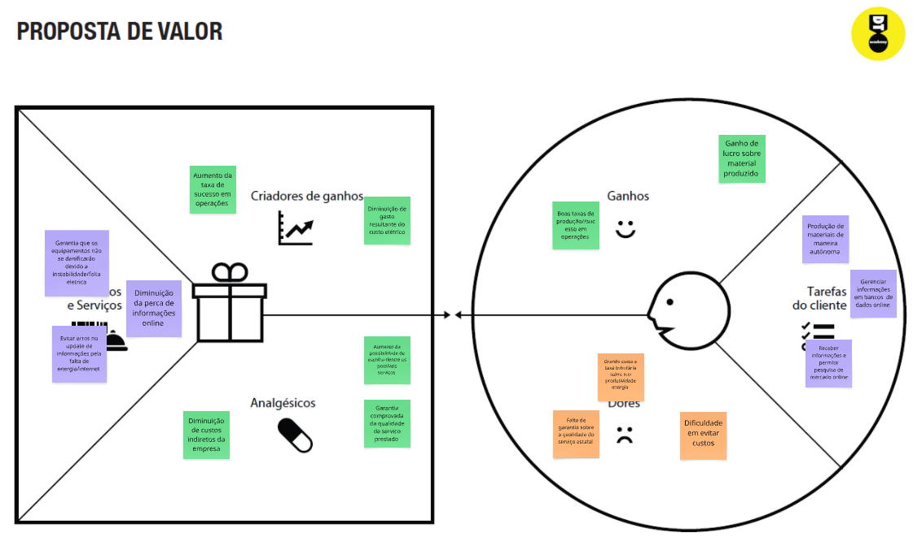
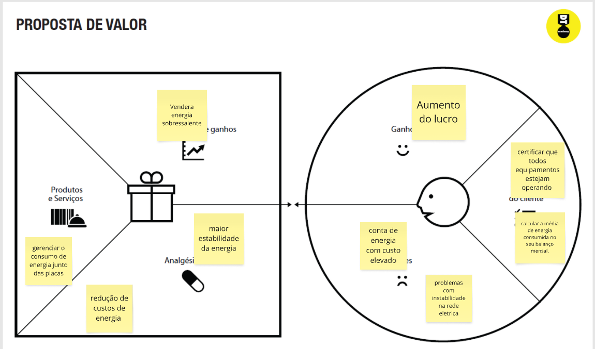

# Introdução

Informações básicas do projeto.

* **Projeto:** Fav sustain
* **Repositório GitHub:** https://github.com/ICEI-PUC-Minas-PMGES-TI/pmg-es-2025-1-ti1-2010200-favaustain.git
* **Membros da equipe:**

  * Marco Túlio Sales de Deus (https://github.com/MarcoTulioES)
  * Ricardo Santana Kill      (https://github.com/Knumi5)
  * André Luiz figueiredo Rosa (https://github.com/Dedecb)
  * Bruno da Silva de Paulo (https://github.com/BrUnOBSP-SVANTH)
  * João Marcelo sposito (https://github.com/joaomsposito)


# Contexto

No Brasil, milhões de famílias em comunidades periféricas enfrentam diariamente o desafio de conviver com contas de luz exorbitantes, que chegam a consumir até 30% da renda familiar mensal. Enquanto isso, o potencial da energia solar - abundante e gratuita - permanece subutilizado nessas localidades. O FavSustain surge como uma ponte entre essa realidade e um futuro mais sustentável, utilizando tecnologia web para democratizar o acesso à energia limpa e acessível.

## Problema

O alto custo da conta de luz, ainda é uma triste realidade na vida de milhares de moradores de comunidades periféricas, comprometendo, muitas vezes, parte significativa da sua renda mensal. A falta de acesso a alternativas sustentáveis de energia e a fragilidade na infraestrutura elétrica. Ademais, a instabilidade no fornecimento e a falta de políticas públicas voltadas para a democratização da energia corroboram para a permanência do descaso. Urge, portanto, uma necessidade real de soluções que reduzam os gastos energéticos dessas populações, proporcionando-os mais segurança, autonomia e uma vida mais digna.

## Objetivos

A Fav Sustain surge como uma solução dos problemas do morador de comunidade periférica, unindo tecnologia, sustentabilidade e inclusão social. Esse projeto busca, por meio de um software, promover a redução da conta de luz,  aliando funcionalidades como o monitoramento do consumo e a
venda de soluções sustentáveis, como painéis solares de baixo custo. Sendo assim, busca-se democratizar o acesso a tecnologia verde, proporcionando uma melhor qualidade de vida aos moradores usuário do nosso sistema e a preservação do meio ambiente. 

## Justificativa

Tem gente que vive com o sol batendo na laje, mas continua no escuro. É assim pra muitas famílias das periferias: a luz do sol é de graça, mas a da conta de luz pesa. Todo mês, lá vem o susto: tarifas altas, fios mal cuidados, falta de informação… e nenhum botão pra desligar o problema.

Foi daí que nasceu o Fav Sustain. Um projeto que não quer reinventar o mundo, só ajudar quem vive nele com dignidade. A ideia é simples: criar um aplicativo que ajuda o morador a entender como a energia tá sendo usada, onde dá pra economizar e, mais do que isso, mostrar alternativas reais, como os painéis solares de baixo custo — soluções que hoje parecem distantes, mas podem ficar bem mais próximas.

O aplicativo vai ser feito ouvindo quem importa: os próprios moradores. Vamos aplicar questionários, fazer entrevistas, entender os desafios de verdade, sem achismo. Porque tecnologia que não escuta vira só mais um monte de botão que ninguém aperta.

E por que isso importa? Porque uma pequena economia na conta de luz pode virar comida no prato, ou um gás que dura mais. Porque um aplicativo no celular pode ser a chave pra uma vida mais leve. E porque, no fim das contas, o sol brilha pra todo mundo — só falta alguém construir a janela certa.

## Público-Alvo

O projeto Fav Sustain é direcionado a moradores de comunidades periféricas, com ênfase especial em famílias de baixa renda que enfrentam dificuldades para arcar com os custos da energia elétrica. Trata-se de um grupo socialmente vulnerável, que, em sua maioria, possui acesso limitado a informações técnicas sobre consumo consciente e sustentável de energia, além de pouca familiaridade com tecnologias voltadas à geração alternativa, como a energia solar.

Dentro desse público, destaca-se um segmento de grande relevância econômica e social: os pequenos empreendedores locais. Profissionais como barbeiros, donos de mercearias, açougues, oficinas e salões de beleza dependem diretamente do fornecimento de energia elétrica para manter seus negócios operando. No entanto, muitos enfrentam instabilidade no abastecimento e tarifas elevadas, o que compromete sua produtividade e reduz significativamente os lucros mensais.

# Product Discovery

## Etapa de Entendimento

Matriz CSD (Certezas, Suposições e Dúvidas): Organizamos as informações levantadas sobre o consumo de energia nas periferias e identificamos pontos que precisam de mais investigação, como a viabilidade da adoção de tecnologias sustentáveis de baixo custo.

Mapa de Stakeholders: permitiu identificar os principais atores envolvidos com o problema, incluindo moradores, pequenos comerciantes (como barbeiros, donos de açougues, donos de mercearias), líderes comunitários, organizações sociais e possíveis fornecedores de soluções sustentáveis.

Entrevistas qualitativas: foram conduzidas entrevistas com moradores de periferias e microempreendedores locais para entender seus hábitos de consumo, nível de conhecimento sobre energia solar e barreiras enfrentadas para economizar energia. Essas entrevistas foram essenciais para validar hipóteses sobre o problema.

Highlights de pesquisa: foram compilados os principais achados das entrevistas, revelando padrões como a falta de acesso à informação sobre economia de energia, receio quanto ao investimento inicial em tecnologias sustentáveis e interesse crescente em alternativas como energia solar, desde que acessíveis.

## Etapa de Definição

### Personas

**✳️✳️✳️ APRESENTE OS DIAGRAMAS DE PERSONAS ✳️✳️✳️**

Persona 1: Marcelo Silva – O Trabalhador Popular
Idade: 40 anos

Profissão: Pedreiro

Hobby: Jogar bola

Sonhos: Construir sua casa e garantir uma boa vida para seus filhos

Comportamento: Usa o celular no dia a dia e assiste TV com a família. Valoriza o tempo em casa.

Objetivo com o Fav Sustain: Reduzir a conta de luz e ter energia estável em sua residência.

Marcelo representa o público principal do Fav Sustain — trabalhadores da periferia que sofrem com contas altas de energia e instabilidade elétrica. O software deve ser simples, acessível, com linguagem clara e oferecer opções de financiamento e compra facilitada de placas solares.

Persona 2: Marcelo Pires da Silva – O Comerciante Local
Idade: 53 anos

Profissão: Dono de mercearia e bar

Hobby: Cuidar de plantas e jogar sinuca

Sonhos: Ter um sítio para se aposentar

Comportamento: Utiliza celular, televisor e aparelhos como geladeiras e freezers constantemente.

Objetivo com o Fav Sustain: Diminuir os gastos energéticos do comércio e evitar interrupções.

Marcelo Pires representa os microempreendedores da periferia, que enfrentam desafios com energia cara e instável. A solução deve incluir uma simulação de economia para estabelecimentos comerciais e apresentar como a energia solar pode evitar perdas com quedas de luz.

Persona 3: Jordan de Andrede Agraméu – O Empresário Sustentável
Idade: 34 anos

Profissão: Dono de franquias

Hobby: Correr

Sonhos: Transformar sua empresa em referência de sustentabilidade

Comportamento: Usa notebook, tablet, no-breaks e equipamentos automatizados

Objetivo com o Fav Sustain: Buscar soluções sustentáveis e econômicas para seus negócios.

Jordan representa o público empresarial que pode ampliar o alcance do projeto, seja como parceiro, patrocinador ou cliente premium. A plataforma pode oferecer funcionalidades voltadas à gestão energética e relatórios de impacto sustentável.

# Product Design

 PRIORIDADES DA SOLUÇÃO

-Reduzir os custos com energia elétrica

-Oferecer uma interface simples e intuitiva para usuários com pouco acesso à tecnologia

-Acompanhar a geração e o consumo de energia em tempo real

-Emitir alertas de falhas ou quedas no sistema

-Enviar lembretes para manutenção preventiva dos sistemas

-Gerar relatórios de economia e retorno de investimento

-Oferecer previsões climáticas para otimizar o uso da energia solar

-Promover a conscientização sobre o impacto ambiental

  SOLUÇÕES PROPOSTAS
Painel de Monitoramento de Energia
Visualização em tempo real da geração e do consumo de energia elétrica, com indicadores simples (ícones, cores e gráficos intuitivos).

Alertas Inteligentes
Notificações automáticas sobre falhas no sistema, quedas de energia ou necessidade de limpeza/manutenção dos painéis solares.

Relatórios e Gráficos de Economia
Geração de relatórios visuais que mostram a economia mensal, o retorno sobre investimento e o impacto ambiental evitado.

Previsão do Tempo Integrada
Informações climáticas para ajudar o usuário a planejar melhor o uso da energia solar.

Sistema de Dicas e Educação Energética
Sessão com orientações práticas sobre como usar melhor a energia e entender o sistema instalado.

Interface Acessível e Inclusiva
Navegação simples, com uso de elementos visuais claros e linguagem acessível a todos os perfis de usuários.


## Histórias de Usuários

Dona Maria (58 anos, aposentada): "Como moradora de comunidade, quero entender quanto posso economizar com energia solar para decidir se vale a pena investir minhas economias."
Seu Jorge (dono de mercearia): "Como pequeno comerciante, preciso monitorar meu consumo em tempo real para evitar surpresas na conta de luz e planejar melhor meus gastos."
Carlos (líder comunitário): "Como representante da associação, quero relatórios simples de economia energética para mostrar aos moradores os benefícios coletivos."
Ana (mãe solo): "Como mãe, preciso de alertas quando meu consumo está acima do normal para ajustar meus hábitos e evitar contas altas."
Marcelo (eletricista): "Como profissional, quero receber notificações de manutenção preventiva para manter os sistemas operando com eficiência."
Dra. Juliana (médica): "Como responsável pelo posto de saúde, preciso garantir energia estável para não interromper o atendimento aos pacientes."
Tiago (empreendedor): "Como dono de startup, quero calcular o retorno do investimento em solar para convencer meus investidores."
Sra. Rosa (dona de pensão): "Como administradora, preciso de um sistema simples para gerenciar o consumo e dividir os custos entre os hóspedes."

## Proposta de Valor





## Requisitos

Requisitos Funcionais:

| ID     | Descrição                                          | Prioridade |
|--------|----------------------------------------------------|------------|
| RF-001 | Consultar consumo estimado de energia              | ALTA       |
| RF-002 | Calcular economia com energia solar                | ALTA       |
| RF-003 | Listar placas solares acessíveis                   | ALTA       |
| RF-004 | Comprar placa solar pelo app                       | MÉDIA      |
| RF-005 | Enviar dicas de economia e sustentabilidade        | MÉDIA      |

Requisitos Não Funcionais:
| ID      | Descrição                                          | Prioridade |
|---------|----------------------------------------------------|------------|
| RNF-001 | App responsivo para Android e iOS                  | ALTA       |
| RNF-002 | Carregamento das páginas em até 3s                 | MÉDIA      |
| RNF-003 | Interface simples e acessível                      | ALTA       |
| RNF-004 | Segurança nas transações de compra                 | ALTA       |


## Projeto de Interface

Artefatos relacionados com a interface e a interacão do usuário na proposta de solução.

### Wireframes

Estes são os protótipos de telas do sistema.

INTERFACE DO SITE
)

### User Flow

FLUXO DE TELAS
)

# Metodologia

Detalhes sobre a organização do grupo e o ferramental empregado.

## Ferramentas

Relação de ferramentas empregadas pelo grupo durante o projeto.

| Ambiente                    | Plataforma | Link de acesso                                     |
| --------------------------- | ---------- | -------------------------------------------------- |
| Processo de Design Thinking | Miro       | https://miro.com/app/board/uXjVIZ5HaeI=/?share_link_id=456018721310 |
| Repositório de código     | GitHub     | https://github.com/ICEI-PUC-Minas-PMGES-TI/pmg-es-2025-1-ti1-2010200-favaustain |
| Hospedagem do site          | Render     | https://site.render.com/XXXXXXX |
| Protótipo Interativo       | MarvelApp  | https://marvelapp.com/XXXXXXX |

## Gerenciamento do Projeto

*Recursos
-Templates
-Textos padrão
-Pesquisas
-Materiais reutilizáveis

*Backlog (Tarefas a serem desenvolvidas)
-Criar protótipo
-Desenvolver simulador
-Listar fornecedores
-Criar landing page

*Para Fazer (Selecionadas para a próxima sprint)
-Tela inicial
-Teste da API
-Jornada do usuário
-Kit solar básico

*Fazendo (Em desenvolvimento no momento)
-Simulador em construção
-Layout da tela de recomendação
-Sistema de parcelamento

*Controle de Qualidade (Testes e revisões)
-Prototipação finalizada
-Texto da home revisado
-Simulador testado

*Feito (Concluído e aprovado)
-Proposta validada
-Wireframe pronto
-Pitch finalizado

*Bloqueado (Tarefas com impedimentos)
-Aguardando fornecedor
-Problemas na API
-Bug em layout mobile

# Solução Implementada

Esta seção apresenta todos os detalhes da solução criada no projeto.

## Vídeo do Projeto

O vídeo a seguir traz uma apresentação do problema que a equipe está tratando e a proposta de solução. ⚠️ EXEMPLO ⚠️

[](https://www.youtube.com/embed/70gGoFyGeqQ)

## Funcionalidades

Esta seção apresenta as funcionalidades da solução.Info

##### Funcionalidade 1 - Cadastro de Contatos ⚠️ EXEMPLO ⚠️

Permite a inclusão, leitura, alteração e exclusão de contatos para o sistema

* **Estrutura de dados:** [Contatos](#ti_ed_contatos)
* **Instruções de acesso:**
  * Abra o site e efetue o login
  * Acesse o menu principal e escolha a opção Cadastros
  * Em seguida, escolha a opção Contatos
* **Tela da funcionalidade**:


> ⚠️ **APAGUE ESSA PARTE ANTES DE ENTREGAR SEU TRABALHO**
>
> Apresente cada uma das funcionalidades que a aplicação fornece tanto para os usuários quanto aos administradores da solução.
>
> Inclua, para cada funcionalidade, itens como: (1) titulos e descrição da funcionalidade; (2) Estrutura de dados associada; (3) o detalhe sobre as instruções de acesso e uso.

## Estruturas de Dados

Descrição das estruturas de dados utilizadas na solução com exemplos no formato JSON.Info

##### Estrutura de Dados - Contatos   ⚠️ EXEMPLO ⚠️

Contatos da aplicação

```json
  {
    "id": 1,
    "nome": "Leanne Graham",
    "cidade": "Belo Horizonte",
    "categoria": "amigos",
    "email": "Sincere@april.biz",
    "telefone": "1-770-736-8031",
    "website": "hildegard.org"
  }
  
```

##### Estrutura de Dados - Usuários  ⚠️ EXEMPLO ⚠️

Registro dos usuários do sistema utilizados para login e para o perfil do sistema

```json
  {
    id: "eed55b91-45be-4f2c-81bc-7686135503f9",
    email: "admin@abc.com",
    id: "eed55b91-45be-4f2c-81bc-7686135503f9",
    login: "admin",
    nome: "Administrador do Sistema",
    senha: "123"
  }
```

> ⚠️ **APAGUE ESSA PARTE ANTES DE ENTREGAR SEU TRABALHO**
>
> Apresente as estruturas de dados utilizadas na solução tanto para dados utilizados na essência da aplicação quanto outras estruturas que foram criadas para algum tipo de configuração
>
> Nomeie a estrutura, coloque uma descrição sucinta e apresente um exemplo em formato JSON.
>
> **Orientações:**
>
> * [JSON Introduction](https://www.w3schools.com/js/js_json_intro.asp)
> * [Trabalhando com JSON - Aprendendo desenvolvimento web | MDN](https://developer.mozilla.org/pt-BR/docs/Learn/JavaScript/Objects/JSON)

## Módulos e APIs

Esta seção apresenta os módulos e APIs utilizados na solução

**Images**:

* Unsplash - [https://unsplash.com/](https://unsplash.com/) ⚠️ EXEMPLO ⚠️

**Fonts:**

* Icons Font Face - [https://fontawesome.com/](https://fontawesome.com/) ⚠️ EXEMPLO ⚠️

**Scripts:**

* jQuery - [http://www.jquery.com/](http://www.jquery.com/) ⚠️ EXEMPLO ⚠️
* Bootstrap 4 - [http://getbootstrap.com/](http://getbootstrap.com/) ⚠️ EXEMPLO ⚠️

> ⚠️ **APAGUE ESSA PARTE ANTES DE ENTREGAR SEU TRABALHO**
>
> Apresente os módulos e APIs utilizados no desenvolvimento da solução. Inclua itens como: (1) Frameworks, bibliotecas, módulos, etc. utilizados no desenvolvimento da solução; (2) APIs utilizadas para acesso a dados, serviços, etc.

# Referências

As referências utilizadas no trabalho foram:

* SOBRENOME, Nome do autor. Título da obra. 8. ed. Cidade: Editora, 2000. 287 p ⚠️ EXEMPLO ⚠️

> ⚠️ **APAGUE ESSA PARTE ANTES DE ENTREGAR SEU TRABALHO**
>
> Inclua todas as referências (livros, artigos, sites, etc) utilizados no desenvolvimento do trabalho.
>
> **Orientações**:
>
> - [Formato ABNT](https://www.normastecnicas.com/abnt/trabalhos-academicos/referencias/)
> - [Referências Bibliográficas da ABNT](https://comunidade.rockcontent.com/referencia-bibliografica-abnt/)
