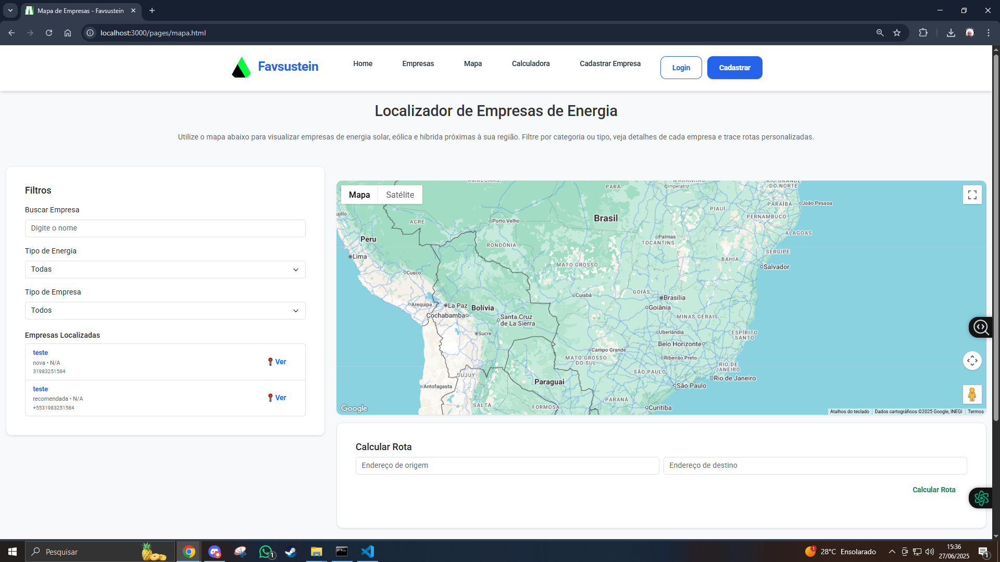
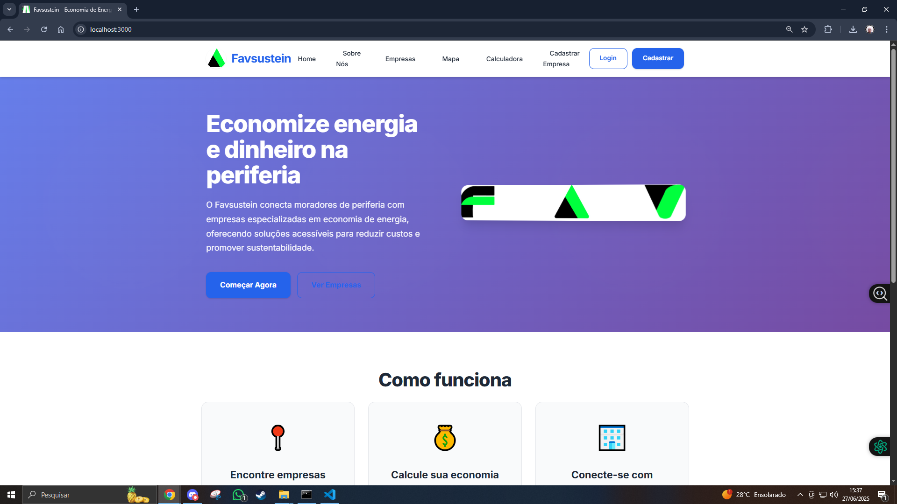
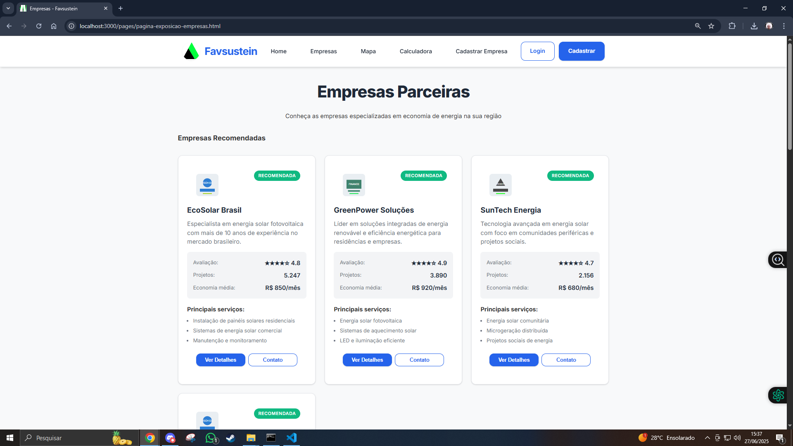
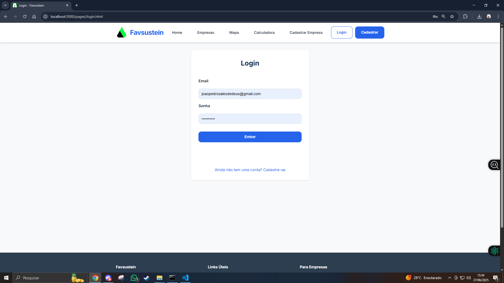
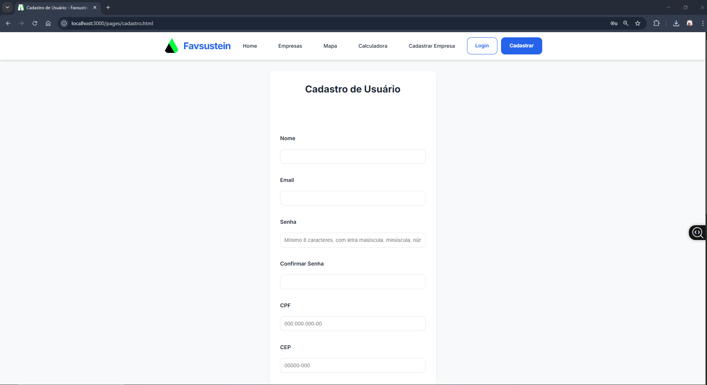
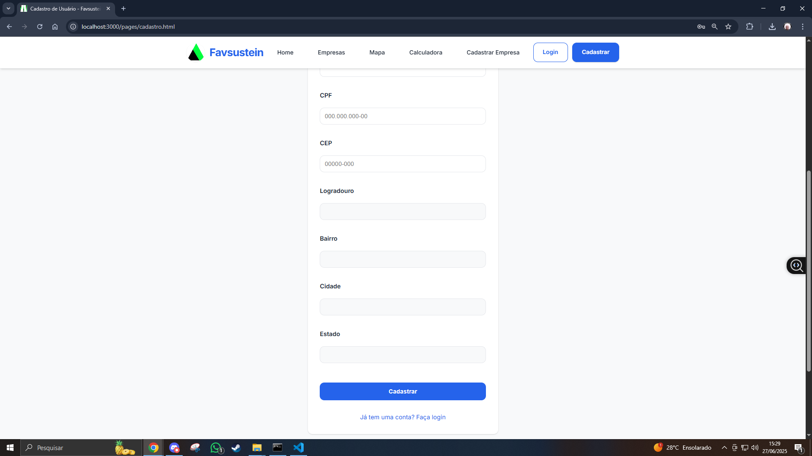
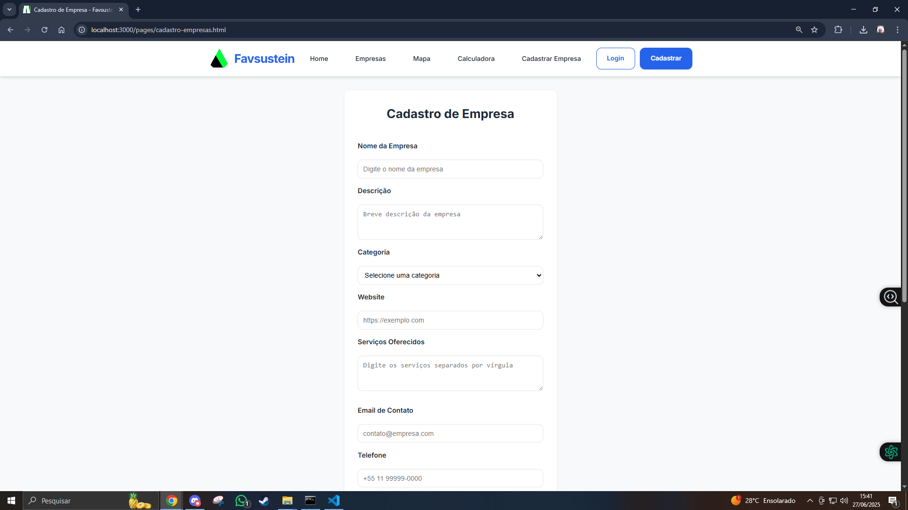
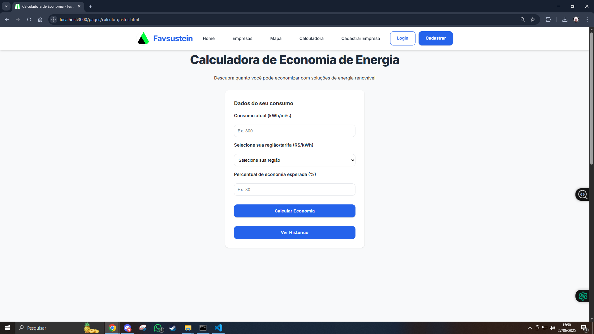

# Introdução

Informações básicas do projeto.

* **Projeto:** Fav sustain
* **Repositório GitHub:** https://github.com/ICEI-PUC-Minas-PMGES-TI/pmg-es-2025-1-ti1-2010200-favaustain.git
* **Membros da equipe:**

  * Marco Túlio Sales de Deus (https://github.com/MarcoTulioES)
  * Ricardo Santana Kill      (https://github.com/Knumi5)
  * André Luiz figueiredo Rosa (https://github.com/Dedecb)
  * Bruno da Silva de Paulo (https://github.com/BrUnOBSP-SVANTH)


# Contexto

O Favsustein é uma plataforma web inovadora desenvolvida para democratizar o acesso à economia de energia nas comunidades periféricas do Brasil. O projeto visa conectar moradores de periferia com empresas especializadas em soluções de energia renovável e eficiência energética, oferecendo ferramentas práticas para calcular gastos
energéticos, identificar oportunidades de economia e encontrar fornecedores confiáveis em suas regiões. 

A plataforma foi concebida e desenvolvida por uma equipe de estudantes de Engenharia de Software da PUC Minas, unindo conhecimento técnico com responsabilidade social.
O sistema oferece funcionalidades como calculadora de economia energética, mapeamento de empresas especializadas, sistema de cadastro para usuários e
empresas, e ferramentas de análise de consumo.

## Problema

O alto custo da conta de luz, ainda é uma triste realidade na vida de milhares de moradores de comunidades periféricas, comprometendo, muitas vezes, parte significativa da sua renda mensal. A falta de acesso a alternativas sustentáveis de energia e a fragilidade na infraestrutura elétrica. Ademais, a instabilidade no fornecimento e a falta de políticas públicas voltadas para a democratização da energia corroboram para a permanência do descaso. Urge, portanto, uma necessidade real de soluções que reduzam os gastos energéticos dessas populações, proporcionando-os mais segurança, autonomia e uma vida mais digna.

## Objetivos

A Fav Sustain surge como uma solução dos problemas do morador de comunidade periférica, unindo tecnologia, sustentabilidade e inclusão social. Esse projeto busca, por meio de um software, promover a redução da conta de luz,  aliando funcionalidades como o monitoramento do consumo e a
venda de soluções sustentáveis, como painéis solares de baixo custo. Sendo assim, busca-se democratizar o acesso a tecnologia verde, proporcionando uma melhor qualidade de vida aos moradores usuário do nosso sistema e a preservação do meio ambiente. 

## Justificativa

Tem gente que vive com o sol batendo na laje, mas continua no escuro. É assim pra muitas famílias das periferias: a luz do sol é de graça, mas a da conta de luz pesa. Todo mês, lá vem o susto: tarifas altas, fios mal cuidados, falta de informação… e nenhum botão pra desligar o problema.

Foi daí que nasceu o Fav Sustain. Um projeto que não quer reinventar o mundo, só ajudar quem vive nele com dignidade. A ideia é simples: criar um aplicativo que ajuda o morador a entender como a energia tá sendo usada, onde dá pra economizar e, mais do que isso, mostrar alternativas reais, como os painéis solares de baixo custo — soluções que hoje parecem distantes, mas podem ficar bem mais próximas.

O aplicativo vai ser feito ouvindo quem importa: os próprios moradores. Vamos aplicar questionários, fazer entrevistas, entender os desafios de verdade, sem achismo. Porque tecnologia que não escuta vira só mais um monte de botão que ninguém aperta.

E por que isso importa? Porque uma pequena economia na conta de luz pode virar comida no prato, ou um gás que dura mais. Porque um aplicativo no celular pode ser a chave pra uma vida mais leve. E porque, no fim das contas, o sol brilha pra todo mundo — só falta alguém construir a janela certa.

## Público-Alvo

O projeto Fav Sustain é direcionado a moradores de comunidades periféricas, com ênfase especial em famílias de baixa renda que enfrentam dificuldades para arcar com os custos da energia elétrica. Trata-se de um grupo socialmente vulnerável, que, em sua maioria, possui acesso limitado a informações técnicas sobre consumo consciente e sustentável de energia, além de pouca familiaridade com tecnologias voltadas à geração alternativa, como a energia solar.

Dentro desse público, destaca-se um segmento de grande relevância econômica e social: os pequenos empreendedores locais. Profissionais como barbeiros, donos de mercearias, açougues, oficinas e salões de beleza dependem diretamente do fornecimento de energia elétrica para manter seus negócios operando. No entanto, muitos enfrentam instabilidade no abastecimento e tarifas elevadas, o que compromete sua produtividade e reduz significativamente os lucros mensais.

# Product Discovery

## Etapa de Entendimento

Matriz CSD (Certezas, Suposições e Dúvidas): Organizamos as informações levantadas sobre o consumo de energia nas periferias e identificamos pontos que precisam de mais investigação, como a viabilidade da adoção de tecnologias sustentáveis de baixo custo.

Mapa de Stakeholders: permitiu identificar os principais atores envolvidos com o problema, incluindo moradores, pequenos comerciantes (como barbeiros, donos de açougues, donos de mercearias), líderes comunitários, organizações sociais e possíveis fornecedores de soluções sustentáveis.

Entrevistas qualitativas: foram conduzidas entrevistas com moradores de periferias e microempreendedores locais para entender seus hábitos de consumo, nível de conhecimento sobre energia solar e barreiras enfrentadas para economizar energia. Essas entrevistas foram essenciais para validar hipóteses sobre o problema.

Highlights de pesquisa: foram compilados os principais achados das entrevistas, revelando padrões como a falta de acesso à informação sobre economia de energia, receio quanto ao investimento inicial em tecnologias sustentáveis e interesse crescente em alternativas como energia solar, desde que acessíveis.

## Etapa de Definição

### Personas

**✳️✳️✳️ APRESENTE OS DIAGRAMAS DE PERSONAS ✳️✳️✳️**

Persona 1: Marcelo Silva – O Trabalhador Popular
Idade: 40 anos

Profissão: Pedreiro

Hobby: Jogar bola

Sonhos: Construir sua casa e garantir uma boa vida para seus filhos

Comportamento: Usa o celular no dia a dia e assiste TV com a família. Valoriza o tempo em casa.

Objetivo com o Fav Sustain: Reduzir a conta de luz e ter energia estável em sua residência.

Marcelo representa o público principal do Fav Sustain — trabalhadores da periferia que sofrem com contas altas de energia e instabilidade elétrica. O software deve ser simples, acessível, com linguagem clara e oferecer opções de financiamento e compra facilitada de placas solares.

Persona 2: Marcelo Pires da Silva – O Comerciante Local
Idade: 53 anos

Profissão: Dono de mercearia e bar

Hobby: Cuidar de plantas e jogar sinuca

Sonhos: Ter um sítio para se aposentar

Comportamento: Utiliza celular, televisor e aparelhos como geladeiras e freezers constantemente.

Objetivo com o Fav Sustain: Diminuir os gastos energéticos do comércio e evitar interrupções.

Marcelo Pires representa os microempreendedores da periferia, que enfrentam desafios com energia cara e instável. A solução deve incluir uma simulação de economia para estabelecimentos comerciais e apresentar como a energia solar pode evitar perdas com quedas de luz.

Persona 3: Jordan de Andrede Agraméu – O Empresário Sustentável
Idade: 34 anos

Profissão: Dono de franquias

Hobby: Correr

Sonhos: Transformar sua empresa em referência de sustentabilidade

Comportamento: Usa notebook, tablet, no-breaks e equipamentos automatizados

Objetivo com o Fav Sustain: Buscar soluções sustentáveis e econômicas para seus negócios.

Jordan representa o público empresarial que pode ampliar o alcance do projeto, seja como parceiro, patrocinador ou cliente premium. A plataforma pode oferecer funcionalidades voltadas à gestão energética e relatórios de impacto sustentável.

# Product Design

 PRIORIDADES DA SOLUÇÃO

-Reduzir os custos com energia elétrica

-Oferecer uma interface simples e intuitiva para usuários com pouco acesso à tecnologia

-Acompanhar a geração e o consumo de energia em tempo real

-Emitir alertas de falhas ou quedas no sistema

-Enviar lembretes para manutenção preventiva dos sistemas

-Gerar relatórios de economia e retorno de investimento

-Oferecer previsões climáticas para otimizar o uso da energia solar

-Promover a conscientização sobre o impacto ambiental

  SOLUÇÕES PROPOSTAS
Painel de Monitoramento de Energia
Visualização em tempo real da geração e do consumo de energia elétrica, com indicadores simples (ícones, cores e gráficos intuitivos).

Alertas Inteligentes
Notificações automáticas sobre falhas no sistema, quedas de energia ou necessidade de limpeza/manutenção dos painéis solares.

Relatórios e Gráficos de Economia
Geração de relatórios visuais que mostram a economia mensal, o retorno sobre investimento e o impacto ambiental evitado.

Previsão do Tempo Integrada
Informações climáticas para ajudar o usuário a planejar melhor o uso da energia solar.

Sistema de Dicas e Educação Energética
Sessão com orientações práticas sobre como usar melhor a energia e entender o sistema instalado.

Interface Acessível e Inclusiva
Navegação simples, com uso de elementos visuais claros e linguagem acessível a todos os perfis de usuários.


## Histórias de Usuários

| EU COMO     | PRECISO DE      | PARA                  |
|-------------|------------------|------------------------|
| Consumidor  | Monitorar energia| Ver economia           |
| Consumidor  | Ver clima        | Usar melhor solar      |
| Consumidor  | Alertas          | Acionar suporte        |
| Comerciante | Software simples | Contagens fáceis       |
| Proprietário| Ver retorno      | Avaliar economia       |
| Empresário  | Ver impacto      | Ser sustentável        |
| Adm. cond.  | Relatórios       | Mostrar benefícios     |
| Dono sistema| Lembrete limpeza | Manter eficiência      |
| Comerciante | Garantir func.   | Operar na queda de luz |

## Proposta de Valor


## Requisitos

Requisitos Funcionais:

| ID     | Descrição                                          | Prioridade |
|--------|----------------------------------------------------|------------|
| RF-001 | Consultar consumo estimado de energia              | ALTA       |
| RF-002 | Calcular economia com energia solar                | ALTA       |
| RF-003 | Listar placas solares acessíveis                   | ALTA       |
| RF-004 | Comprar placa solar pelo app                       | MÉDIA      |
| RF-005 | Enviar dicas de economia e sustentabilidade        | MÉDIA      |

Requisitos Não Funcionais:
| ID      | Descrição                                          | Prioridade |
|---------|----------------------------------------------------|------------|
| RNF-001 | App responsivo para Android e iOS                  | ALTA       |
| RNF-002 | Carregamento das páginas em até 3s                 | MÉDIA      |
| RNF-003 | Interface simples e acessível                      | ALTA       |
| RNF-004 | Segurança nas transações de compra                 | ALTA       |


## Projeto de Interface

Artefatos relacionados com a interface e a interacão do usuário na proposta de solução.

### Wireframes

Estes são os protótipos de telas do sistema.

INTERFACE DO SITE






### User Flow

FLUXO DE TELAS
()

# Metodologia

Detalhes sobre a organização do grupo e o ferramental empregado.

## Ferramentas

Relação de ferramentas empregadas pelo grupo durante o projeto.

| Ambiente                    | Plataforma | Link de acesso                                     |
| --------------------------- | ---------- | -------------------------------------------------- |
| Processo de Design Thinking | Miro       | ( https://miro.com/app/board/uXjVIZ5HaeI=/?share_link_id=456018721310 )|
| Repositório de código     | GitHub     |   ( https://github.com/ICEI-PUC-Minas-PMGES-TI/pmg-es-2025-1-ti1-2010200-favaustain.git )|
| Hospedagem do site          | Render     | ( https://9a5dc9cb-cc39-496a-bb5a-489e7a201252-00-1trx2orxgq11c.picard.replit.dev/ ) |

## Gerenciamento do Projeto

*Recursos
-Templates
-Textos padrão
-Pesquisas
-Materiais reutilizáveis

*Backlog (Tarefas a serem desenvolvidas)
-Criar protótipo
-Desenvolver simulador
-Listar fornecedores
-Criar landing page

*Para Fazer (Selecionadas para a próxima sprint)
-Tela inicial
-Teste da API
-Jornada do usuário
-Kit solar básico

*Fazendo (Em desenvolvimento no momento)
-Simulador em construção
-Layout da tela de recomendação
-Sistema de parcelamento

*Controle de Qualidade (Testes e revisões)
-Prototipação finalizada
-Texto da home revisado
-Simulador testado

*Feito (Concluído e aprovado)
-Proposta validada
-Wireframe pronto
-Pitch finalizado

*Bloqueado (Tarefas com impedimentos)
-Aguardando fornecedor
-Problemas na API
-Bug em layout mobile

# Solução Implementada

Esta seção apresenta todos os detalhes da solução criada no projeto.

## Vídeo do Projeto

O vídeo a seguir traz uma apresentação do problema que a equipe está tratando e a proposta de solução. 

[](https://youtu.be/kmwyUee2kNg)

## Funcionalidades

Esta seção apresenta as funcionalidades da solução.Info

##### Funcionalidade 1 - Cadastro de usuários

Permite o cadastro do usuario, pedindo nome, email, cpf, senha e cep (cep e cpf são verificados na area de cadastro e não permitimos que o email se repita)

* **Estrutura de dados:** [usuarios](#estrutura-de-dados---usuários)
* **Instruções de acesso:**
  * Abra o site e vá para a area de cadastrar
  * preencha todos os dados corretamente
  * clique em cadastrar 
* **Tela da funcionalidade**:




##### Funcionalidade 2 - Login de Usuário

Permite que o usuário acesse sua conta utilizando e-mail e senha cadastrados previamente. O sistema valida as credenciais e redireciona o usuário à página principal da aplicação.

* **Estrutura de dados:** [usuarios](#estrutura-de-dados---usuários)
* **Instruções de acesso:**
  * Acesse a página inicial do site
  * Clique em "Login"
  * Insira seu e-mail e senha válidos
  * Clique em "Login" 
* **Tela da funcionalidade**:


##### Funcionalidade 3 - Cadastro de Empresas

Permite que um usuário cadastrado registre uma empresa fornecedora de serviços sustentáveis, informando nome, descrição, serviços, contato e localização.

* **Estrutura de dados:** [Empresas](#estrutura-de-dados---empresas)
* **Instruções de acesso:**
  * Acesse sua conta na plataforma
  * Vá até a seção “Cadastrar Empresa”
  * Preencha os campos
  * clique em cadastrar 
* **Tela da funcionalidade**:


##### Funcionalidade 4 - Cálculo de Economia de Energia

Permite que o usuário simule seu consumo energético mensal e descubra quanto poderia economizar utilizando soluções sustentáveis.
* **Estrutura de dados:** [calculos](#estrutura-de-dados---calculos-de-economia)
* **Instruções de acesso:** 
  * Acesse sua conta
  * Vá até a seção calculadora”
  * Preencha os dados de consumo (consumo atual em kWh, tarifa, região)
  * Clique em “Calcular”
* **Tela da funcionalidade**:


##### Funcionalidade 5 - Mapa de Empresas com API Google Maps

Apresenta no mapa interativo todas as empresas cadastradas na plataforma, utilizando a Google Maps API. Cada empresa é exibida com um marcador e informações de contato.

* **Estrutura de dados:** [empresas](#estrutura-de-dados---empresas)
* **Instruções de acesso:**
  * Vá até a seção “Mapa”
  * Aguarde o carregamento do mapa com base na sua localização
  * Clique nos marcadores para visualizar os dados de cada empresa
* **Tela da funcionalidade**:


> 
## Estruturas de Dados

Esta seção descreve as principais estruturas de dados utilizadas na solução Fav Sustain, que sustentam o funcionamento do sistema, como o cadastro de usuários, empresas, simulações de economia energética e metadados da aplicação. Os dados são armazenados em formato JSON, garantindo interoperabilidade e facilidade de manipulação com tecnologias web modernas.

##### Estrutura de Dados - Usuários  

Registra os moradores e microempreendedores que utilizam a plataforma para simular economia e encontrar fornecedores sustentáveis.

```json
{
  "id": "nMMIGtH",
  "nome": "joao",
  "email": "joaopedrosalesdedeus@gmail.com",
  "senha": "Teste1234!",
  "cpf": "14047123641",
  "endereco": {
    "cep": "30840040",
    "logradouro": "Rua dos Comerciantes",
    "bairro": "Alípio de Melo",
    "cidade": "Belo Horizonte",
    "estado": "MG"
  },
  "dataCadastro": "2025-06-23T19:08:34.627Z",
  "ultimoAcesso": "2025-06-23T21:45:05.149Z"
}
```
##### Estrutura de Dados - Empresas

Contém os dados das empresas que prestam serviços de energia sustentável, como instalação e manutenção de painéis solares.

```json
{
  "id": "LTHz7ul",
  "nome": "teste",
  "descricao": "teste",
  "categoria": "nova",
  "servicos": ["teste"],
  "contato": {
    "email": "joaopedrosalesdedeus@gmail.com",
    "telefone": "31983251584",
    "site": "https://www.monsterenergy.com/pt-br/"
  },
  "endereco": {
    "logradouro": "comerciantes 175",
    "coordenadas": {
      "latitude": 0,
      "longitude": 0
    }
  },
  "historico": "teste",
  "dataCadastro": "2025-06-23T19:09:46.980Z",
  "status": "ativo",
  "usuarioId": "nMMIGtH",
  "avaliacao": 0,
  "projetos": 0,
  "economia_media": "N/A",
  "imagem": "/assets/img/empresa-nova-1.svg"
}
```

##### Estrutura de Dados - Calculos de economia 

Armazena as simulações de consumo energético realizadas pelos usuários, com cálculo de economia, projeção anual e impacto ambiental.

```json
{
  "id": "calc_1750961722759",
  "usuarioId": "nMMIGtH",
  "data": "2025-06-26T18:15:22.759Z",
  "consumo": {
    "atual": 300,
    "tarifa": 0.55,
    "regiao": "Sul",
    "economiaEsperada": 0.3,
    "economiaCalculada": 90
  },
  "resultados": {
    "gastoAtual": 165,
    "gastoComEconomia": 115.5,
    "economiaMensal": 49.5,
    "economiaAnual": 594,
    "reducaoCO2": 7.353
  }
}
```

##### Estrutura de Dados - Metadata 

Guarda informações auxiliares do sistema, como versão da aplicação e data da última atualização da base de dados.

```json
{
  "ultimaAtualizacao": "",
  "versao": "1.0"
}
```

## Módulos e APIs

Esta seção apresenta os principais módulos, bibliotecas, frameworks e APIs utilizadas no desenvolvimento da solução Fav Sustain. A integração entre esses recursos permitiu construir uma aplicação funcional, responsiva e conectada com dados geográficos em tempo real.

**Images**:

* Unsplash- Utilizado como fonte de imagens de alta qualidade para compor a interface do sistema.
 [https://unsplash.com/](https://unsplash.com/)

**Fonts:**

* Font Awesome – Biblioteca de ícones vetoriais utilizada para enriquecer a experiência visual da interface.
 [https://fontawesome.com/](https://fontawesome.com/) 

**Scripts:**

* Bootstrap 5 – Utilizado para estilização, responsividade e componentes visuais do front-end. [https://getbootstrap.com/](https://getbootstrap.com/)
* jQuery – Utilizado para facilitar manipulações DOM e requisições AJAX de forma simplificada. [http://www.jquery.com/](http://www.jquery.com/) 
* JSON Server – Ferramenta utilizada para simular uma API RESTful com base em um arquivo db.json, permitindo testes locais com dados reais.
 [https://github.com/typicode/json-server](https://github.com/typicode/json-server) 


# Referências

ABSOLAR. Anuário Brasileiro de Energia Solar Fotovoltaica 2023. Associação Brasileira de Energia Solar Fotovoltaica, 2023. Disponível em: https://www.absolar.org.br/anuarios. 
ANEEL. Resolução Normativa nº 1.000/2021. Agência Nacional de Energia Elétrica, 2021. Disponível em: https://www.aneel.gov.br/resolucoes. 
IBGE. Pesquisa de Orçamentos Familiares 2017-2018. Instituto Brasileiro de Geografia e Estatística, 2023. 
Disponível em: https://www.ibge.gov.br/estatisticas/sociais/rendimento-despesa-e-consumo/24786-pof-2017-2018.html. 
IPCC. Climate Change 2022: Mitigation of Climate Change. Intergovernmental Panel on Climate Change, 2022. Disponível em: https://www.ipcc.ch/report/ar6/wg3/. 
MINISTÉRIO DE MINAS E ENERGIA. Balanço Energético Nacional 2023. Brasília, 2023. 
Disponível em: https://www.epe.gov.br/pt/publicacoes-dados-abertos/publicacoes/balanco-energetico-nacional. 
ONU BRASIL. ODS 7: Energia Acessível e Limpa. Nações Unidas Brasil,	2021. 
Disponível em: https://brasil.un.org/pt-br/sdgs/7. 
PNUD. Relatório de Desenvolvimento Humano 2020. Programa das Nações Unidas para o Desenvolvimento, 2020. Disponível em: https://www.br.undp.org/content/brazil/pt/home/library/idh/relatorios-de-desenvolvimento-humano.html. 
SILVA, R. A.; SANTOS, M. B. Energia Solar em Comunidades de Baixa Renda: Estudo de Caso no Complexo do Alemão. Revista Brasileira de Energias Renováveis, v.10, n.2, p.45-60,		2021. 
Disponível em: https://www.revistas.usp.br/rber/article/view/123456. 
